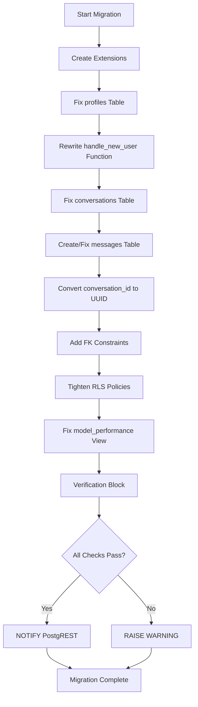

I have created the following plan after thorough exploration and analysis of the codebase. Follow the below plan verbatim. Trust the files and references. Do not re-verify what's written in the plan. Explore only when absolutely necessary. First implement all the proposed file changes and then I'll review all the changes together at the end.

## Observations

The codebase has **multiple conflicting schema definitions** across `file:backend/supabase_chat_schema.sql`, `file:database/supabase_schema.sql`, and `file:supabase/migrations/20250126000000_ai_features_schema.sql`. The backend code in `file:backend/app/agents/chat_agent.py` expects both a `conversations` table (with metadata columns) and a separate `messages` table, while `file:backend/app/routes/chat.py` treats `conversations` as a flat message store. The audit identified 15 critical issues including: profiles table missing email/full_name columns, conversation_id type mismatches (TEXT vs UUID), unsafe `handle_new_user()` function, overly permissive RLS policies, and `model_performance` view referencing non-existent `request_timestamp` column.

## Approach

Create a **single safe migration script** (`file:supabase/migrations/20251216_safe_schema_fixes.sql`) using **ALTER TABLE statements** (not CREATE TABLE IF NOT EXISTS) to fix the existing database schema without data loss. The migration will: (1) add missing columns to profiles/conversations/messages tables, (2) convert conversation_id types to UUID with proper FK constraints, (3) rewrite the `handle_new_user()` function to be safe with ON CONFLICT DO NOTHING, (4) tighten all RLS policies with explicit TO clauses and user_id checks, (5) fix the `model_performance` view to use `created_at`, (6) standardize on `gen_random_uuid()`, and (7) include a comprehensive verification block that checks columns, FKs, and policies exist before declaring success.

## Implementation Steps

### 1. Create Migration File Header and Extensions

Create `file:supabase/migrations/20251216_safe_schema_fixes.sql` with:
- Header comment explaining this is a safe schema fix migration
- `CREATE EXTENSION IF NOT EXISTS "uuid-ossp"` and `CREATE EXTENSION IF NOT EXISTS "pgcrypto"`
- DO block to handle duplicate_object exceptions for extensions

### 2. Fix profiles Table Schema

Add missing columns to `profiles` table:
- `ALTER TABLE public.profiles ADD COLUMN IF NOT EXISTS email TEXT`
- `ALTER TABLE public.profiles ADD COLUMN IF NOT EXISTS full_name TEXT`
- `ALTER TABLE public.profiles ADD COLUMN IF NOT EXISTS company TEXT`
- `ALTER TABLE public.profiles ADD COLUMN IF NOT EXISTS avatar_url TEXT`
- `ALTER TABLE public.profiles ADD COLUMN IF NOT EXISTS created_at TIMESTAMPTZ DEFAULT NOW()`
- `ALTER TABLE public.profiles ADD COLUMN IF NOT EXISTS updated_at TIMESTAMPTZ DEFAULT NOW()`

Add unique constraint on email if not exists:
- Use DO block to check if constraint exists before adding: `ALTER TABLE public.profiles ADD CONSTRAINT profiles_email_unique UNIQUE (email)`

### 3. Rewrite handle_new_user() Function Safely

Replace the `handle_new_user()` function with safe version:
```sql
CREATE OR REPLACE FUNCTION public.handle_new_user()
RETURNS TRIGGER AS $
BEGIN
  INSERT INTO public.profiles (id, created_at)
  VALUES (NEW.id, NOW())
  ON CONFLICT (id) DO NOTHING;
  RETURN NEW;
END;
$ LANGUAGE plpgsql SECURITY DEFINER;
```

Revoke execute permissions:
- `REVOKE EXECUTE ON FUNCTION public.handle_new_user() FROM anon, authenticated`

Ensure trigger exists:
- `DROP TRIGGER IF EXISTS on_auth_user_created ON auth.users`
- `CREATE TRIGGER on_auth_user_created AFTER INSERT ON auth.users FOR EACH ROW EXECUTE FUNCTION public.handle_new_user()`

### 4. Fix conversations Table Schema

Add missing columns to `conversations` table:
- `ALTER TABLE public.conversations ADD COLUMN IF NOT EXISTS status TEXT DEFAULT 'active'`
- `ALTER TABLE public.conversations ADD COLUMN IF NOT EXISTS channel TEXT DEFAULT 'chat'`
- `ALTER TABLE public.conversations ADD COLUMN IF NOT EXISTS metadata JSONB DEFAULT '{}'::jsonb`
- `ALTER TABLE public.conversations ADD COLUMN IF NOT EXISTS updated_at TIMESTAMPTZ DEFAULT NOW()`
- `ALTER TABLE public.conversations ADD COLUMN IF NOT EXISTS user_id UUID`

Add CHECK constraint for status:
- Use DO block: `ALTER TABLE public.conversations ADD CONSTRAINT conversations_status_check CHECK (status IN ('active', 'paused', 'completed', 'archived'))`

Add FK to profiles if not exists:
- Use DO block to check: `ALTER TABLE public.conversations ADD CONSTRAINT conversations_user_id_fkey FOREIGN KEY (user_id) REFERENCES public.profiles(id) ON DELETE SET NULL`

Add updated_at trigger:
- `DROP TRIGGER IF EXISTS update_conversations_updated_at ON public.conversations`
- `CREATE TRIGGER update_conversations_updated_at BEFORE UPDATE ON public.conversations FOR EACH ROW EXECUTE FUNCTION update_updated_at_column()`

### 5. Create or Fix messages Table

Check if `messages` table exists, if not create it:
```sql
CREATE TABLE IF NOT EXISTS public.messages (
  id UUID PRIMARY KEY DEFAULT gen_random_uuid(),
  conversation_id UUID NOT NULL,
  role TEXT NOT NULL CHECK (role IN ('user', 'assistant', 'system')),
  content TEXT NOT NULL,
  agent_type TEXT,
  metadata JSONB DEFAULT '{}'::jsonb,
  created_at TIMESTAMPTZ DEFAULT NOW()
);
```

If table exists, add missing columns:
- `ALTER TABLE public.messages ADD COLUMN IF NOT EXISTS agent_type TEXT`
- `ALTER TABLE public.messages ADD COLUMN IF NOT EXISTS metadata JSONB DEFAULT '{}'::jsonb`

Convert `conversation_id` to UUID if it's TEXT:
- Use DO block to check column type
- If TEXT: `ALTER TABLE public.messages ALTER COLUMN conversation_id TYPE UUID USING conversation_id::uuid`

Add FK constraint to conversations:
- Use DO block: `ALTER TABLE public.messages ADD CONSTRAINT messages_conversation_id_fkey FOREIGN KEY (conversation_id) REFERENCES public.conversations(id) ON DELETE CASCADE`

Add indexes:
- `CREATE INDEX IF NOT EXISTS idx_messages_conversation_id ON public.messages(conversation_id)`
- `CREATE INDEX IF NOT EXISTS idx_messages_created_at ON public.messages(created_at DESC)`

Enable RLS:
- `ALTER TABLE public.messages ENABLE ROW LEVEL SECURITY`

### 6. Tighten RLS Policies on All Tables

For `profiles` table:
- Drop existing policies: `DROP POLICY IF EXISTS "Users can view own profile" ON public.profiles`
- Create tightened policy: `CREATE POLICY "profiles_users_select_own" ON public.profiles FOR SELECT TO authenticated USING (id = auth.uid())`
- `CREATE POLICY "profiles_users_update_own" ON public.profiles FOR UPDATE TO authenticated USING (id = auth.uid())`
- `CREATE POLICY "profiles_service_full_access" ON public.profiles FOR ALL TO service_role USING (true) WITH CHECK (true)`

For `conversations` table:
- Drop overly permissive policies
- `CREATE POLICY "conversations_users_select_own" ON public.conversations FOR SELECT TO authenticated USING (user_id = auth.uid() OR user_id IS NULL)`
- `CREATE POLICY "conversations_service_full_access" ON public.conversations FOR ALL TO service_role USING (true) WITH CHECK (true)`
- `CREATE POLICY "conversations_anon_insert" ON public.conversations FOR INSERT TO anon WITH CHECK (true)` (if needed for public chat)

For `messages` table:
- `CREATE POLICY "messages_users_select_own" ON public.messages FOR SELECT TO authenticated USING (EXISTS (SELECT 1 FROM public.conversations c WHERE c.id = messages.conversation_id AND c.user_id = auth.uid()))`
- `CREATE POLICY "messages_service_full_access" ON public.messages FOR ALL TO service_role USING (true) WITH CHECK (true)`

For `workflow_executions` table (if exists):
- `DROP POLICY IF EXISTS "Authenticated read access" ON public.workflow_executions`
- `CREATE POLICY "workflow_executions_users_select_own" ON public.workflow_executions FOR SELECT TO authenticated USING (EXISTS (SELECT 1 FROM public.conversations c WHERE c.id = workflow_executions.conversation_id AND c.user_id = auth.uid()))`
- `CREATE POLICY "workflow_executions_service_full_access" ON public.workflow_executions FOR ALL TO service_role USING (true) WITH CHECK (true)`

### 7. Fix model_performance View

Drop and recreate the view to use `created_at`:
```sql
DROP VIEW IF EXISTS public.model_performance;
CREATE OR REPLACE VIEW public.model_performance AS
SELECT
  model_name,
  COUNT(*) as total_requests,
  AVG(response_time_ms) as avg_response_time,
  SUM(tokens_used) as total_tokens,
  COUNT(*) FILTER (WHERE success = true) as successful_requests,
  COUNT(*) FILTER (WHERE success = false) as failed_requests,
  (COUNT(*) FILTER (WHERE success = true)::FLOAT / COUNT(*)::FLOAT * 100) as success_rate
FROM public.model_metrics
WHERE created_at >= NOW() - INTERVAL '7 days'
GROUP BY model_name;
```

### 8. Standardize UUID Generation

Create helper function to migrate any remaining `uuid_generate_v4()` to `gen_random_uuid()`:
- Add comment noting that `gen_random_uuid()` (pgcrypto) is preferred over `uuid_generate_v4()` (uuid-ossp)
- Update any default values in table definitions if needed

### 9. Add Comprehensive Verification Block

Create DO block at end of migration:
```sql
DO $
DECLARE
  v_profiles_email_exists BOOLEAN;
  v_conversations_status_exists BOOLEAN;
  v_messages_table_exists BOOLEAN;
  v_messages_fk_exists BOOLEAN;
  v_policy_count INTEGER;
BEGIN
  -- Check profiles columns
  SELECT EXISTS (
    SELECT 1 FROM information_schema.columns 
    WHERE table_schema = 'public' AND table_name = 'profiles' AND column_name = 'email'
  ) INTO v_profiles_email_exists;
  
  -- Check conversations columns
  SELECT EXISTS (
    SELECT 1 FROM information_schema.columns 
    WHERE table_schema = 'public' AND table_name = 'conversations' AND column_name = 'status'
  ) INTO v_conversations_status_exists;
  
  -- Check messages table exists
  SELECT EXISTS (
    SELECT 1 FROM information_schema.tables 
    WHERE table_schema = 'public' AND table_name = 'messages'
  ) INTO v_messages_table_exists;
  
  -- Check messages FK constraint
  SELECT EXISTS (
    SELECT 1 FROM information_schema.table_constraints 
    WHERE table_schema = 'public' AND table_name = 'messages' 
    AND constraint_type = 'FOREIGN KEY' AND constraint_name LIKE '%conversation_id%'
  ) INTO v_messages_fk_exists;
  
  -- Count policies
  SELECT COUNT(*) INTO v_policy_count FROM pg_policies WHERE schemaname = 'public';
  
  -- Report results
  IF v_profiles_email_exists AND v_conversations_status_exists AND v_messages_table_exists AND v_messages_fk_exists AND v_policy_count > 0 THEN
    RAISE NOTICE '✅ All required schema fixes applied successfully!';
    RAISE NOTICE '  - profiles table: email column exists';
    RAISE NOTICE '  - conversations table: status/channel/metadata columns exist';
    RAISE NOTICE '  - messages table: exists with FK to conversations';
    RAISE NOTICE '  - RLS policies: % policies configured', v_policy_count;
  ELSE
    RAISE WARNING '⚠️  Some schema fixes may not have applied correctly:';
    RAISE WARNING '  - profiles.email exists: %', v_profiles_email_exists;
    RAISE WARNING '  - conversations.status exists: %', v_conversations_status_exists;
    RAISE WARNING '  - messages table exists: %', v_messages_table_exists;
    RAISE WARNING '  - messages FK exists: %', v_messages_fk_exists;
    RAISE WARNING '  - Policy count: %', v_policy_count;
  END IF;
END $;
```

### 10. Add NOTIFY for PostgREST Reload

At the end of the migration:
- `NOTIFY pgrst, 'reload config';`
- Add comment explaining this forces Supabase to reload the schema cache

### 11. Document Migration in Comments

Add comprehensive comments throughout the migration explaining:
- Why each change is needed (reference audit issue numbers)
- What the change does
- Any data migration considerations
- Rollback instructions if needed

## Migration Structure Diagram



## Key Files to Create/Modify

| File | Action | Purpose |
|------|--------|---------|
| `file:supabase/migrations/20251216_safe_schema_fixes.sql` | CREATE | Main safe migration script with all fixes |

## Critical Safety Measures

- Use `ALTER TABLE ... ADD COLUMN IF NOT EXISTS` to avoid errors on re-runs
- Use DO blocks with exception handling for constraints/FKs
- Use `ON CONFLICT DO NOTHING` in handle_new_user() to prevent duplicate key errors
- Check column types before attempting conversions
- Drop and recreate policies instead of trying to alter them
- Comprehensive verification block to confirm all changes applied
- NOTIFY PostgREST to force schema cache reload